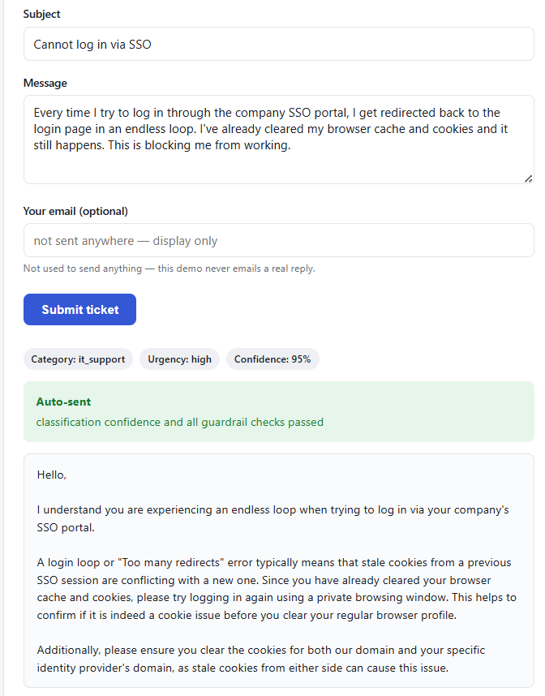
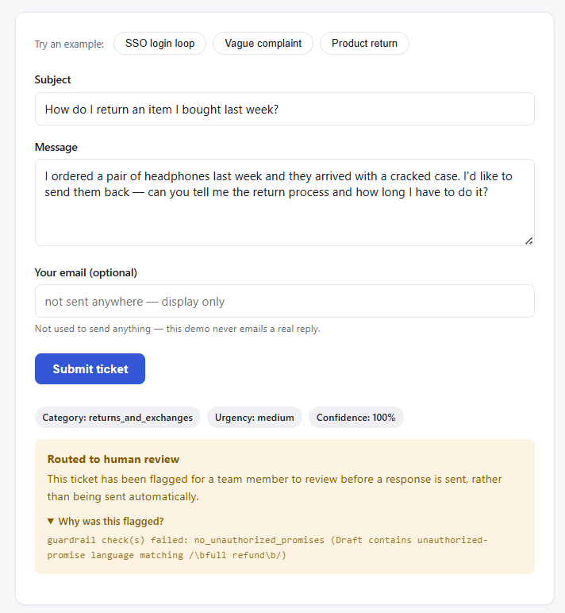

# Support Ticket Agent

A RAG-powered customer support agent that classifies incoming tickets,
retrieves relevant knowledge-base articles, drafts a grounded reply,
checks that reply against a set of guardrails, and routes it to either
auto-send or a human review queue. Built as a portfolio project to
demonstrate end-to-end LLM application engineering — not just an API
wrapper around a chat completion: a typed multi-node agent graph
(LangGraph), a real retrieval pipeline with its own precision/recall
numbers, deterministic post-hoc guardrails instead of prompt-only safety,
a provider-agnostic LLM layer, and an evaluation harness that produces
real, reproducible numbers rather than hand-waved claims.

## Live demo

**[support-ticket-agent-9ptn.onrender.com/demo](https://support-ticket-agent-9ptn.onrender.com/demo)**

Runs on Render's free tier — the instance spins down when idle, so the
first request after a while can take 30-60 seconds to cold-start. Submit
a ticket and it runs through the real pipeline (classify → retrieve →
draft → guardrail → route) live; nothing is canned. Nothing you submit is
emailed anywhere — the drafted reply is only ever shown on the page. See
[`PORTFOLIO_ADDITIONS.md`](PORTFOLIO_ADDITIONS.md) for why this
unauthenticated demo surface exists alongside the authenticated API, and
its Security section (linked below) for the safeguards on it.

## Screenshots

<!--
  TODO (screenshots not yet added — no browser/screenshot tooling was
  available to generate these automatically):
  1. Open the live demo link above.
  2. Click "SSO login loop", submit, screenshot the result panel, save as
     docs/screenshot-auto-send.png — it reliably classifies as
     it_support/high confidence and auto-sends with a grounded reply.
  3. Click "Vague complaint", submit, screenshot the result panel, save as
     docs/screenshot-human-review.png — low-detail tickets typically fall
     below the confidence threshold and route to human review.
  Once both files exist at those paths, the images below render as-is —
  no further edits needed.
-->




## Architecture

```
Ticket → classify → retrieve → draft → guardrail_check → route → auto-send | human review
```

An explicit [LangGraph](https://github.com/langchain-ai/langgraph) state
machine (`agent/graph.py`), not a single mega-prompt — every node reads
and writes specific typed fields on a shared `AgentState` and is
independently unit-tested. Retrieval runs against a local Chroma vector
store built from 40 hand-authored knowledge-base articles. Guardrails
(`agent/guardrails.py`) are plain testable functions — unauthorized
promises, PII, tone, and citation grounding — not "please don't do X" in
a prompt. Structured JSON logging (`observability/`) traces every node's
input/output summary, latency, and the final routing decision per ticket.

Full phase-by-phase spec: [`BUILD_PLAN.md`](BUILD_PLAN.md).

## Key results

From the locked Phase 5 full-graph evaluation run (`eval/results/full_report.md`,
`72eb1ea`, n=40 hand-reviewed gold-set tickets, real Anthropic API, not
mocked):

| Metric | Value |
|---|---|
| Category accuracy | 67.5% |
| Category F1 (macro) | 0.577 |
| Urgency accuracy | 62.5% |
| Urgency F1 (macro) | 0.633 |
| Retrieval precision@3 | 0.333 |
| Retrieval recall@5 | 1.000 |
| Generation helpfulness (LLM-as-judge, 1-5) | 3.80 |
| Generation correctness (LLM-as-judge, 1-5) | 4.90 |
| Generation tone (LLM-as-judge, 1-5) | 4.15 |
| Auto-send rate @ confidence threshold 0.75 | 25.0% |
| Avg latency per ticket | 12.68 s |
| Est. cost per ticket (real, verified Anthropic pricing) | $0.02029 |

These numbers, including their limitations (small per-class support,
category-boundary ambiguity in the classifier, run-to-run sampling
noise), are discussed honestly in `eval/results/classification_report.md`
and `eval/results/full_report.md` — nothing here is cherry-picked, and
every run in those files came from an actual script execution, never
hand-written.

## Notable engineering decisions

**Swappable LLM provider, not a hardcoded SDK call.** Every node asks
`agent/llm_client.py` for a `ModelTier` (`FAST`/`STRONG`), never a
concrete model or vendor. `LLM_PROVIDER=gemini|anthropic` switches the
whole app between Google Gemini and Anthropic Claude with no code
change; both are fully implemented (`agent/providers/`), and provider
SDKs are imported lazily so a deployment only pays for the one it
actually uses.

**Free-tier cost constraints shaped real design decisions, not just
model choice.** Gemini's free tier is the default specifically so the
eval suite and demo run at zero cost; the public demo endpoint
(`/demo/tickets`) hard-forces Gemini regardless of the app's configured
provider (a `contextvars` override, not an env var — safe under
concurrent traffic) plus a per-IP rate limit and a global daily cap, so
an anonymous visitor can never generate real (billed) cost. The one
locked eval run against real Anthropic pricing above exists specifically
to report a true cost-per-ticket number instead of an illustrative one.

**A few bugs worth mentioning, because how they were found matters more
than that they existed:**

- **Anthropic structured output silently corrupting nested schemas.**
  Forced tool-use wrapped `DraftResponse` (which contains a list of
  grounding objects) in a bogus `{"$PARAMETER_NAME": {...}}` key,
  100% reproducibly, only for schemas with an array-of-objects via
  `$ref` — plain enum fields were unaffected. Root-caused by direct
  schema inspection, not guessed; fixed by switching to
  `client.messages.parse()`, then locked in with an opt-in live
  regression test specifically for that schema shape.
- **A Render free-tier OOM crash traced to a silently-resolved CUDA
  wheel.** The deployed app kept crashing at "used over 512Mi." A
  step-by-step RSS-measurement script (not a guess) showed
  `sentence-transformers`/`torch` costing ~261MB just to import — and
  the Render build log confirmed `torch` had resolved the full
  CUDA-enabled wheel (`nvidia-cudnn`, `nvidia-cufft`, etc.) rather than
  a CPU-only build, since nothing pinned the wheel index. Fixed by
  removing the local embedding model entirely in favor of Gemini's
  hosted embedding API — stronger than pinning a CPU wheel, since "not
  installed" beats "installed CPU-only." Measured before/after: 496MB
  → 236MB for *more* work than the original measurement covered.
- **A rate-limiting decorator silently breaking request parsing.**
  Adding `slowapi` rate limits to the API caused every POST to 422 as
  if the body were missing. Reproduced in isolation before touching
  production code: `slowapi`'s wrapper doesn't forward `__globals__`,
  so with postponed annotations (`from __future__ import annotations`)
  on, FastAPI couldn't resolve the string type hints through the
  wrapper and silently misread the body as a query param. Fixed by
  dropping that import from the one file affected, with the mechanism
  documented in code so it doesn't get reintroduced.

## Running it locally

```bash
git clone <this-repo>
cd support-ticket-agent
pip install -e ".[dev]"          # or: uv sync

# create a .env (gitignored) with the keys from the table below, e.g.:
#   GEMINI_API_KEY=...
#   SUPPORT_AGENT_API_KEY=...

python -m support_agent.knowledge_base.build_index   # builds the local KB vector store
pytest -q                                             # 142 passed, 3 opt-in live tests skipped by default

uvicorn support_agent.api:app --reload
```

Then visit `http://localhost:8000/demo` for the unauthenticated demo UI,
or call `POST /tickets` (below) with an API key.

**Environment variables:**

| Variable | Required | Notes |
|---|---|---|
| `GEMINI_API_KEY` | Yes | Needed even if `LLM_PROVIDER=anthropic` — retrieval always embeds via Gemini's hosted embedding API, and the KB index build needs it too. |
| `ANTHROPIC_API_KEY` | Only if `LLM_PROVIDER=anthropic` | |
| `LLM_PROVIDER` | No | `gemini` (default) or `anthropic`. |
| `SUPPORT_AGENT_API_KEY` | Yes, for `/tickets` | Shared secret checked against the `X-API-Key` header. `/demo/tickets` doesn't need it. |

## Calling the API directly

`POST /tickets` requires the `X-API-Key` header:

```bash
curl -X POST http://localhost:8000/tickets \
  -H "Content-Type: application/json" \
  -H "X-API-Key: YOUR_SUPPORT_AGENT_API_KEY" \
  -d '{
    "subject": "Cannot log in via SSO",
    "body": "I get redirected back to the login page in a loop every time I try to sign in through SSO."
  }'
```

Returns the classification, routing decision (and why), and — if
auto-sent — the drafted response text. See
[`support_agent/api/models.py`](support_agent/api/models.py) for the full
request/response shape.

## Security

Auth, rate limiting, request size bounds, and the last dependency-audit
results are documented in **[`HANDOFF.md` → Security](HANDOFF.md#security)**
— not duplicated here to avoid the two drifting out of sync.

## Tech stack

- **Language/runtime:** Python 3.11+
- **Agent orchestration:** [LangGraph](https://github.com/langchain-ai/langgraph)
- **LLMs:** Anthropic Claude and Google Gemini, swappable (`agent/providers/`)
- **Embeddings:** Gemini hosted embedding API (`gemini-embedding-001`)
- **Vector store:** [Chroma](https://www.trychroma.com/) (local, file-backed)
- **API:** [FastAPI](https://fastapi.tiangolo.com/) + [Uvicorn](https://www.uvicorn.org/)
- **Validation:** [Pydantic v2](https://docs.pydantic.dev/)
- **Rate limiting:** [slowapi](https://github.com/laurentS/slowapi)
- **Structured logging:** [structlog](https://www.structlog.org/)
- **Retries:** [tenacity](https://github.com/jd/tenacity)
- **Demo frontend:** vanilla HTML/CSS/JS, no framework or build step
- **Testing:** pytest, ruff
- **Deployment:** [Render](https://render.com/) (free tier)
